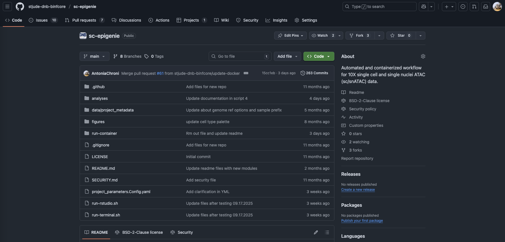
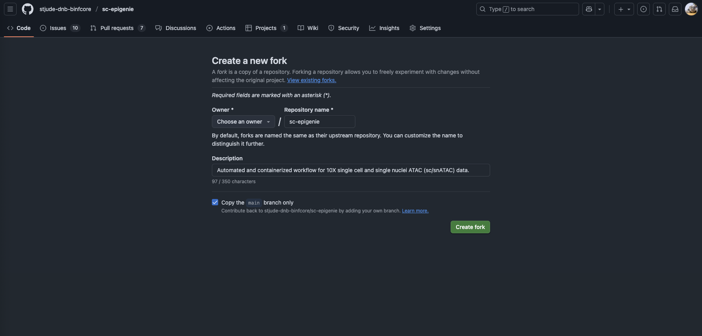
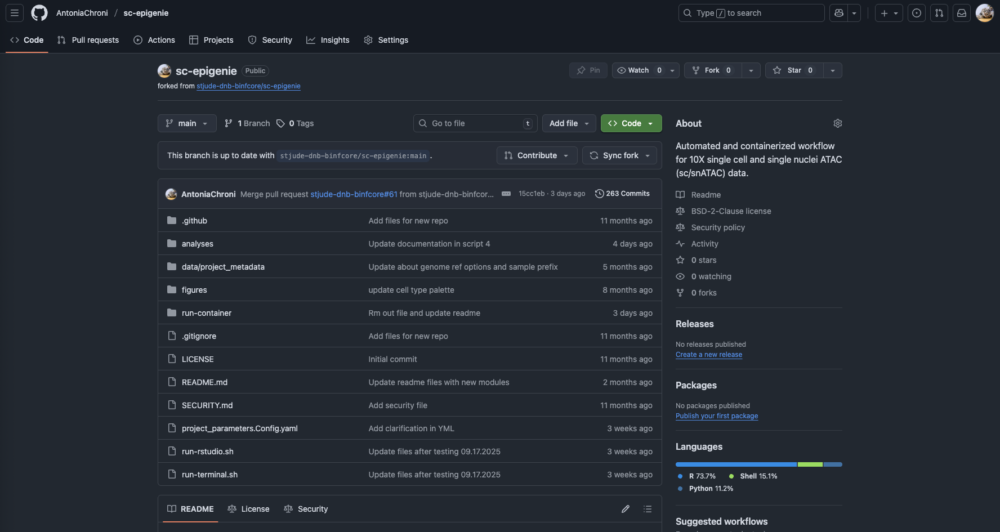

<p align="center";">
  
</p>
<p align="center";">

# Single cell ATAC seq BED builder

## Overview
This repository provides a simple tool for generating BED files-`blacklist.bed`, `promoter.bed`, and `enhancer.bed`-that can be incorporated into 10x Genomics scATAC-seq reference genomes. Including these files enables Cell Ranger ATAC to calculate and report `blacklist_region_fragments`, `promoter_region_fragments`, and `enhancer_region_fragments` in the `singlecell.csv` output when aligning 10x single-cell ATAC-seq data.

 > - Note:
       Recent 10x pre-built reference genomes (2020 and 2024 releases) no longer include these BED files by default, starting with [Cell Ranger ATAC 2.0](https://www.10xgenomics.com/support/software/cell-ranger-atac/latest/release-notes/release-notes#cell-ranger-atac-2-0-may-3-2021-4017ff). For a detailed explanation and step-by-step guideance, refer to [this issue](https://github.com/stjude-dnb-binfcore/sc-epigenie/issues/50).


## Key Features
This tool will allow users to generate properly formatted and filtered BED files for any pre-built or custom 10x scATAC-seq reference genome.

Input files:
- A BED file of blacklist (excluded) regions, and
- A GFF file of regulatory regions for your reference genome release of interest.

Output files:
- blacklist.bed
- enhancer.bed
- promoter.bed

## Why Are These BED Files Important?
BED files for promoters, enhancers, and blacklist regions play a key role in scATAC-seq analysis:

- **Functional Annotation of Peaks:**

  Promoter and enhancer BED files enable annotation of ATAC-seq peaks, identifying accessible regions that correspond to key regulatory elements.

- **Quality Control Metrics:**

  Overlap with promoters and enhancers provides metrics for data quality and biological relevance. Blacklist regions help remove artefactual signals, improving overall data quality and interpretation.

## Integration with scATAC-seq Pipelines
The Single Cell ATAC-seq BED Builder is a companion tool to [scEpiGenie](https://github.com/stjude-dnb-binfcore/sc-epigenie), designed to support the analysis of single-cell ATAC-seq data from 10x Genomics. Single Cell ATAC-seq BED Builder can be used independently or seamlessly integrated into the scEpiGenie workflow to generate the necessary BED files for downstream analysis.

### How to Use the Repository

#### Accessing the Code

We recommend that users fork the `sc-atac-seq-bed-builder` repository and then clone their forked repository to their local machine. Team members should use the [stjude-dnb-binfcore](https://github.com/stjude-dnb-binfcore) account, while others can use their preferred GitHub account. We welcome collaborations, so please feel free to reach out if you're interested in being added to the `stjude-dnb-binfcore` account.

1. Fork the repository

Navigate to the main page of the `stjude-dnb-binfcore/sc-atac-seq-bed-builder` repository and click the "Fork" button.




2. Create Your Fork

You can change the name of the forked repository (optional - unless you will use it for multiple projects). Click "Create fork" to proceed.




3. Enjoy your new project repo!




4. Clone Your Fork

Once you have created the fork, clone it to your local machine:

```
git clone https://github.com/<FORK_NAME>.git
```

### Below is the main directory structure listing the analyses and data files used in this repository

```
├── analyses
|  └── generate-bed-files
├── figures
├── LICENSE
├── project_parameters.Config.yaml
├── README.md
└── SECURITY.md
```

## Authors

Sharon Freshour, PhD ([@sharonfreshour](https://github.com/sharonfreshour))


## Contact

Contributions, issues, and feature requests are welcome! Please feel free to check [issues](https://github.com/stjude-dnb-binfcore/sc-atac-seq-bed-builder/issues).

---

*These tools and pipelines have been developed by the Bioinformatic core team at the [St. Jude Children's Research Hospital](https://www.stjude.org/). These are open access materials distributed under the terms of the [BSD 2-Clause License](https://opensource.org/license/bsd-2-clause), which permits unrestricted use, distribution, and reproduction in any medium, provided the original author and source are credited.*